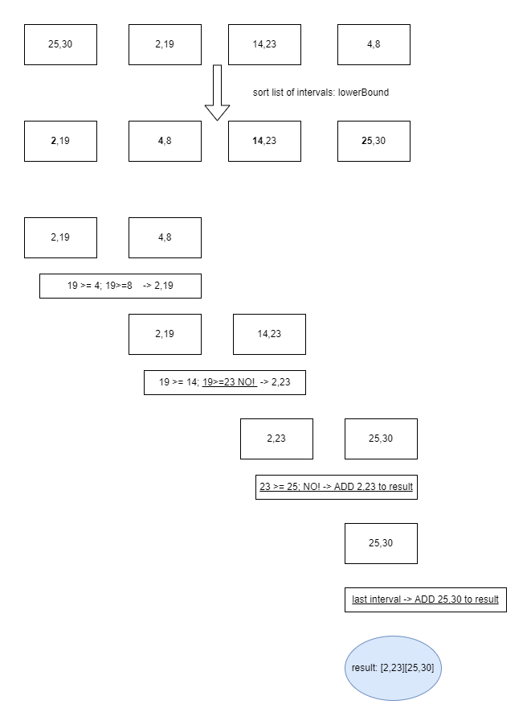

# MBTI_Coding_Task_2
This is the repository to provide the Coding Task 2 solution of Julian Stier.  
It is about implementing a function called merge which takes a list of intervals and returns a list of intervals as well. The result contains all overlapping intervals that are merged. 
All non-overlapping intervals remain untouched.

## Setup instructions
As a prerequisite, Java version 18 and Apache Maven 3.8.5 must be installed. However, the build may also work with older versions.
Subsequently, ``` mvn clean install ```
must be executed on the main folder.

This process creates a target folder that contains a .jar file. This file must be executed.  

## Algorithm explanation
<kbd></kbd>

## What is the runtime of the program?
Since Collections.sort(List<T>) has a complexity of O(n log n) and the for loop has a complexity of O(n) the total complexity is O(n log n).

## How can the robustness be ensured, especially with regard to very large inputs?
For larger input data sets, one solution may be to split the list of intervals into separate lists of intervals and handle each of these partial interval lists in separate threads. At the end, they must then be merged again piece by piece, which can also be done on separate threads depending on the size.

## How does the memory consumption of your program behave ?
For the merge method:

Collections.sort(List<T>) does not do in place sorting. It dumps the specified list into an array, sorts the array, and iterates over the list resetting each element from the corresponding position in the array. This leads to extra needed memory.

The actual algorithm: A separate list is used for the result list, which takes up memory. But this is good programming style (best practices) not to operate on the output list.

However, memory consumption using a list and operating on this list would save memory.